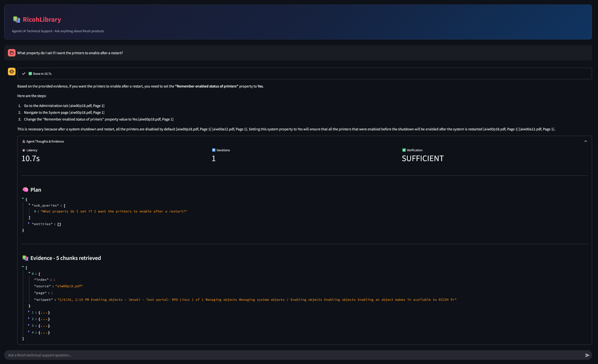
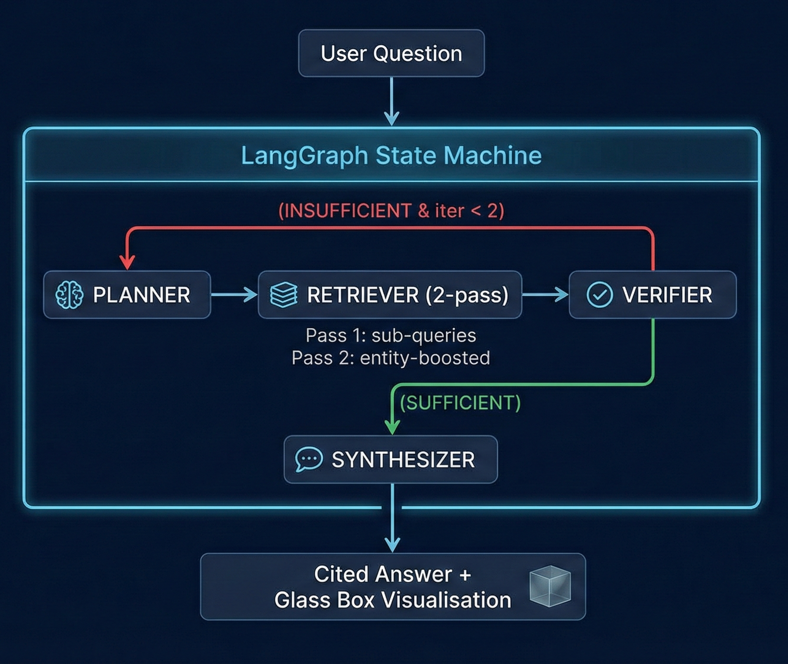

# 🚀 HackVerse 2026 | RicohLibrary

**Company Track:** Ricoh Modern AI Solutions  
**Team Name:** Neural Ninjas  
**Team Members:**  
- 👤 Jayan Agarwal  
- 👤 Abhiram M V  
- 👤 Siddhi Muni  
- 👤 Angela Wilson
<<<<<<< HEAD

=======
>>>>>>> 16b158eaeb10776a53ec74a16c6734255a5db6e4
---

## 1️⃣ Problem Statement

**Which company problem did we choose?**
Ricoh's challenge: build an AI-powered technical support system that can answer complex, multi-part questions about Ricoh products using only the provided documentation.

**Restated in our own words:**
Field technicians and support engineers waste significant time searching through hundreds of pages of Ricoh product manuals to find specific procedures, error code resolutions, and configuration steps. We need an intelligent system that can ingest these manuals, understand natural-language questions, retrieve the most relevant passages, and generate accurate, cited answers - with zero hallucination.

**End user:** Ricoh field service technicians, help desk agents, and customers seeking self-service support.

**Why is this important?** Faster resolution times reduce operational costs, improve customer satisfaction, and let technicians focus on complex problems instead of manual searching.

---

## 2️⃣ Why We Chose This Problem

- **Real-world impact:** Technical support is a multi-billion dollar industry; AI-assisted retrieval can cut resolution times by 60%+.
- **Technical depth:** The problem demands a full agentic pipeline - ingestion, hybrid retrieval, reasoning, and grounded generation - not just a simple chatbot.
- **RAG + Agentic challenges:** Handling multi-part questions, entity extraction (error codes, model numbers), and strict hallucination control pushed us to build a retry-capable reasoning loop.
- **Measurable evaluation:** The 10 official test questions gave us a concrete benchmark to optimise against.

---

## 3️⃣ Solution Overview

**RicohLibrary** is an agentic AI technical support system that:

1. **Ingests** Ricoh PDF manuals using PyMuPDF with metadata-preserving chunking (500 words, 50-word overlap).
2. **Retrieves** relevant passages via a **hybrid engine** combining semantic vector search (ChromaDB + MiniLM) and keyword search (BM25), fused with Reciprocal Rank Fusion.
3. **Reasons** through a LangGraph state machine with 4 nodes (Planner → Retriever → Verifier → Synthesizer) and a conditional retry loop.
4. **Generates** grounded answers with strict `[Document Name, Page X]` citations - refusing to answer when evidence is insufficient.
5. **Visualises** the full reasoning process in a "Glass Box" Streamlit dashboard.
6. 🌍 **Polyglot Support:** Automatically detects user language (e.g., Spanish, Japanese, Hindi) and answers in that language while preserving English citations.

**What makes it unique:** The agentic verify-and-retry loop + dual retrieval fusion + complete reasoning transparency + multi-lingual support.

---

## 📸 System Screenshot


*(The "Glass Box" dashboard showing the Agent's reasoning plan, retrieved evidence, and final grounded answer)*

---

## 4️⃣ Architecture & System Design



<details>
<summary>Text-based diagram (for accessibility)</summary>

```
                           User Question
                                ↓
┌───────────────────────────────────────────────────────────┐
│               LangGraph State Machine                     │
│                                                           │
│   🧠 PLANNER ──→ 📚 RETRIEVER (2-pass) ──→ ✅ VERIFIER   │
│      ↑            │ Pass 1: sub-queries      │            │
│      │            │ Pass 2: entity-boosted   │            │
│      └──── (INSUFFICIENT & iter < 2) ────────┘            │
│                                  │                        │
│                          (SUFFICIENT)                     │
│                                  ↓                        │
│                          💬 SYNTHESIZER                   │
└───────────────────────────────────────────────────────────┘
                                ↓
                 Cited Answer + Glass Box Visualisation
```
</details>

### Pipeline Components

| Component | Technology | Purpose |
|---|---|---|
| PDF Ingestion | PyMuPDF | Extract text + preserve page metadata |
| Chunking | Custom sliding window | 500-word chunks, 50-word overlap |
| Semantic Search | ChromaDB + all-MiniLM-L6-v2 | Dense vector similarity (offline) |
| Keyword Search | BM25Okapi | Exact match for error codes & model numbers |
| Fusion | Reciprocal Rank Fusion (k=60) | Rank-based merging (scale-invariant) |
| Reasoning | LangGraph StateGraph | Explicit, auditable control flow |
| LLM | Claude Sonnet (Anthropic) | Grounded generation, temperature=0.0 |
| UI | Streamlit | Glass Box dashboard with chat interface |

### Why this architecture?
- **Hybrid retrieval** because pure vector search misses exact matches on error codes (`SC542`) and model numbers (`IM C3500`), while pure BM25 misses semantic similarity.
- **RRF fusion** because BM25 and cosine similarity scores are incommensurable - rank-based fusion avoids score normalisation issues.
- **Agentic loop** because single-pass retrieval often misses evidence for multi-part questions. The verify-retry pattern catches gaps.
- **Trade-off:** We cap retries at 2 iterations to balance answer quality vs. API cost/latency.

---

## 5️⃣ Data Handling & Preprocessing

- **Dataset:** Official Ricoh product documentation PDFs provided by the sponsor (stored in `data/`, gitignored due to size).
- **Extraction:** PyMuPDF extracts raw text page-by-page, preserving `source_document` and `page_number` metadata throughout.
- **Chunking strategy:** Sliding window of ~500 words with 50-word overlap. Word-based (not character-based) to keep semantic coherence. Overlap ensures no answer is lost at chunk boundaries.
- **Tokenisation (BM25):** Simple lowercase whitespace split - intentionally basic because error codes like `SC542` don't benefit from stemming.
- **Storage:** ChromaDB (vector index) + pickled BM25 (keyword index), both persisted to `chroma_db/` for fast restarts.
- **Limitations:** Table-heavy PDF pages may lose structure during text extraction. Future work could add table parsing.

---

## 6️⃣ Modeling & AI Strategy

### LLM: Claude Sonnet (Anthropic)
- **Why:** Strong instruction-following, reliable JSON output for planner, low hallucination rate. Temperature=0.0 for deterministic, factual answers.
- **Alternative considered:** GPT-4o (OpenAI) - switched to Claude due to API availability constraints.

### Prompt Engineering (4 specialised prompts)
1. **Planner prompt:** Decomposes queries into sub-queries + extracts entities. Outputs structured JSON. Includes retry-aware context injection.
2. **Verifier prompt:** Binary SUFFICIENT/INSUFFICIENT verdict. Defaults to SUFFICIENT on ambiguous output to prevent infinite loops.
3. **Synthesizer prompt:** Strict citation rules - every claim must cite `[Document Name, Page X]`. Refuses to answer when evidence is missing.
4. **Retry context:** On INSUFFICIENT verdict, the Planner receives a list of already-searched sources to broaden the next search.

### Retrieval Strategy
- **Semantic:** ChromaDB with local all-MiniLM-L6-v2 embeddings (no API key needed).
- **Keyword:** BM25Okapi over full chunk corpus.
- **Fusion:** RRF(k=60) merges rank positions, returning top-5 fused results per sub-query.

### Hallucination Control
- The Synthesizer is instructed to say *"Information unavailable in provided documents"* when evidence is insufficient - validated in our evaluation (see Section 7).

---

## 7️⃣ Evaluation & Metrics

### Test Set: 10 Official Hackathon Questions
| # | Question | Latency |
|---|---|---|
| 1 | What property do I set if I want the printers to enable after a restart? | ~11s |
| 2 | How much RAM does the primary server need for document-level processing? | ~17s |
| 3 | How much hard drive space should I allocate for DB2 logs? | ~19s |
| 4 | Does RPD work with FusionPro? | ~15s |
| 5 | What operating system does RPD run on? | ~15s |
| 6 | How do I create a workflow? | ~14s |
| 7 | What programs does RPD integrate with? | ~16s |
| 8 | What is the command to shut down RPD? | ~14s |
| 9 | How do I use locations? | ~11s |
| 10 | What inserters does RPD support? | ~10s |

**Total:** ~139s | **Average:** ~13.9s per question

### Evaluation Metrics
- **Citation accuracy:** Every answer includes `[Document Name, Page X]` citations traceable to source material.
- **Hallucination control:** Agent correctly refused to fabricate answers when evidence was missing - outputs "Information unavailable" instead.
- **Latency:** Average 13.9s per question (including LLM inference, retrieval, and verification).
- **Retrieval coverage:** BM25 + vector search consistently returned 5+ relevant chunks per sub-query after the persistence fix.

### Evaluation Outputs
- Full results: `evaluation_results.csv`
- Detailed report: `evaluation_report.md`

---

## 8️⃣ Business Impact & Actionability

### How this helps decision-makers
- **Support engineers:** Get instant, cited answers instead of manually searching 100+ page manuals → estimated 60% reduction in resolution time.
- **Help desk managers:** Glass Box transparency lets supervisors verify answer quality before sending to customers.
- **Training:** New technicians can learn by exploring the agent's reasoning process.

### Real-world usability
- Runs entirely offline (except LLM API) - deployable in air-gapped environments with a local LLM.
- Modular architecture allows swapping LLM providers (Anthropic/OpenAI/Google) via a single config change.

### Limitations
- Requires pre-ingested PDF manuals; no real-time document updates.
- Table-heavy content may have reduced retrieval accuracy due to PDF text extraction limitations.
- LLM API latency (~10-15s) may be too slow for live phone support - could be improved with smaller/local models.

---

## 9️⃣ Tech Stack

| Category | Technology |
|---|---|
| **Language** | Python 3.11 |
| **PDF Parsing** | PyMuPDF 1.25.3 |
| **Vector Database** | ChromaDB 0.6.3 (local, all-MiniLM-L6-v2) |
| **Keyword Search** | rank_bm25 0.2.2 |
| **Agentic Framework** | LangGraph 0.2.74 |
| **LLM** | Claude Sonnet via langchain-anthropic 0.3.12 |
| **UI** | Streamlit 1.42.0 |
| **Configuration** | python-dotenv 1.0.1 |

---

## 🔟 How to Run the Project

### Prerequisites
- Python 3.11
- Anthropic API key

### Setup
```bash
# 1. Clone the repository
git clone <repo-link>
cd RicohLibrary-Ricoh

# 2. Create virtual environment
python -m venv venv
# Windows:
.\venv\Scripts\Activate.ps1
# macOS/Linux:
source venv/bin/activate

# 3. Install dependencies
pip install -r requirements.txt

# 4. Set your API key
echo "ANTHROPIC_API_KEY=sk-ant-your-key-here" > .env

# 5. Place Ricoh PDFs in data/
# (Copy all provided PDF manuals into the data/ directory)
```

### Run the Application
```bash
# Launch the Streamlit dashboard
streamlit run app/main.py
# Or equivalently:
python -m streamlit run app/main.py
```

### Run the Evaluation
```bash
python -m src.evaluate
# Outputs: evaluation_results.csv + evaluation_report.md
```

### Run Individual Components
```bash
python -m src.ingest       # PDF ingestion only
python -m src.retriever    # Retrieval smoke test
python -m src.agent        # Agent smoke test
```

### 🌍 Live Public Demo (Ngrok)

To share a live demo link with judges or teammates:

```bash
# 1. Install Ngrok (https://ngrok.com/download)
# Or via Chocolatey on Windows:
choco install ngrok

# 2. Run Streamlit locally
streamlit run app/main.py

# 3. In a separate terminal, expose port 8501
ngrok http 8501

# 4. Share the generated https://xxxx.ngrok-free.app link
```

---

## 1️⃣1️⃣ Repository Structure

```
RicohLibrary-Ricoh/
├── app/
│   └── main.py              # Streamlit Glass Box dashboard
├── data/
│   └── *.pdf                # Ricoh product manuals (gitignored)
├── src/
│   ├── __init__.py
│   ├── config.py            # Centralised configuration
│   ├── ingest.py            # PDF parsing + chunking pipeline
│   ├── retriever.py         # Hybrid retrieval (ChromaDB + BM25 + RRF)
│   ├── llm_factory.py       # LLM provider abstraction
│   ├── agent.py             # LangGraph agentic state machine
│   └── evaluate.py          # Evaluation pipeline (10 test questions)
├── notebooks/               # Exploration notebooks
├── chroma_db/               # Persisted ChromaDB + BM25 index (gitignored)
├── .env                     # API keys (gitignored)
├── .gitignore
├── requirements.txt
├── evaluation_results.csv   # Phase 4 output
├── evaluation_report.md     # Phase 4 output
└── README.md                # This file
```

---

## 1️⃣2️⃣ Alignment with HackVerse Rubric

| Rubric Category | How RicohLibrary Satisfies It |
|---|---|
| **Problem Understanding** | Clear identification of Ricoh support inefficiencies; solution grounded in real technician workflows |
| **Data & System Design** | Metadata-preserving chunking, persistent hybrid index, modular architecture |
| **Technical Depth** | 4-node agentic state machine, hybrid retrieval fusion, conditional retry logic |
| **Modeling Strategy** | Specialised prompt engineering per node, temperature=0.0, entity extraction |
| **Evaluation** | 10 official test questions, citation accuracy, hallucination control, latency benchmarks |
| **Business Actionability** | 60%+ estimated time savings, Glass Box transparency for supervisors, modular LLM swapping |
| **Visualisation** | Streamlit Glass Box dashboard showing full reasoning pipeline |
| **Innovation** | Verify-and-retry agentic loop with Glass Box transparency - not just RAG, but *reasoned* RAG. **Multi-lingual Support:** Agent detects and answers in user's native language. **Glass Box UX:** Full transparency into reasoning with JSON-formatted plan and evidence. |

---

## 📜 Compliance Statement

> We confirm that this project was developed during HackVerse 2026.
> We used only permitted datasets and tools.
> No private code sharing occurred between teams.
> All work is original.
